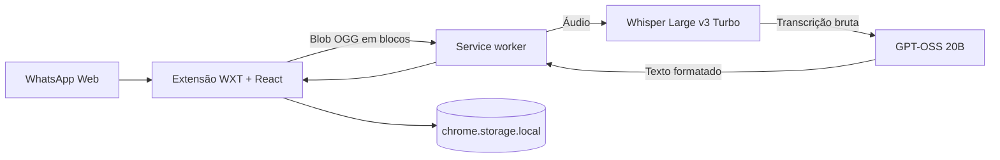

# WhatsApp Audio Transcriber

Extensão Chrome multiplataforma para transcrever mensagens de voz do WhatsApp Web e formatar o resultado com a Groq.

## Pipeline



- O scanner identifica áudios por atributos estruturais, sem depender das classes geradas do WhatsApp.
- Um script no contexto da página intercepta a próxima tentativa de reprodução, captura o `Blob` e bloqueia o som.
- O service worker mantém uma fila serial e envia o OGG diretamente para a API da Groq.
- `whisper-large-v3-turbo` faz a transcrição com detecção automática do idioma.
- `openai/gpt-oss-20b`, com raciocínio baixo e saída estruturada, corrige pontuação, capitalização e parágrafos sem resumir ou traduzir.
- O texto formatado e a transcrição bruta ficam no cache local da extensão.
- A UI usa Shadow DOM para não interferir no CSS do WhatsApp.

## Desenvolvimento

Requisitos:

- Node.js 22 ou superior
- pnpm 11
- uma [API key da Groq](https://console.groq.com/keys)

```bash
pnpm install
pnpm typecheck
pnpm test
pnpm build
```

O build desempacotado fica em:

```text
apps/extension/.output/chrome-mv3
```

## Instalação

1. Abra `chrome://extensions` e habilite o modo de desenvolvedor.
2. Carregue ou recarregue `apps/extension/.output/chrome-mv3`.
3. Abra o popup da extensão.
4. Cole sua API key da Groq e clique em **Salvar e testar**.
5. Abra ou recarregue o WhatsApp Web.

Não é necessário instalar Python, FFmpeg, Whisper ou qualquer host nativo. O mesmo build funciona em macOS, Windows e Linux.

## Privacidade e limites

- A chave fica em `chrome.storage.local` e não é enviada ao WhatsApp nem aos content scripts.
- O áudio é enviado diretamente do service worker para a Groq.
- Nenhum servidor intermediário do projeto é usado.
- O projeto não persiste o áudio; somente os textos ficam em cache.
- Limite atual de 25 MB por áudio, fila de 10 trabalhos e uma execução por vez.
- O cache guarda até 500 transcrições ou aproximadamente 8 MB.
- Na primeira utilização, a UI informa sobre o envio à Groq e sobre o possível estado de reprodução no WhatsApp.

Veja [arquitetura](docs/architecture.md) e [pesquisa do DOM](docs/whatsapp-dom.md) para detalhes técnicos.
