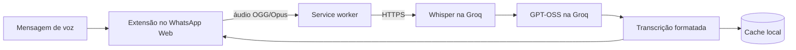

<div align="center">
  
  <h1>WhatsApp Audio Transcriber</h1>
  <p>Transcreva mensagens de voz do WhatsApp Web sem sair da conversa.</p>

  <p>
    <a href="https://github.com/gabrielMalonso/whatsapp-audio-transcriber/actions/workflows/ci.yml"></a>
    <a href="LICENSE"></a>
    <a href="https://developer.chrome.com/docs/extensions/develop/migrate/what-is-mv3"></a>
    <a href="https://groq.com/"></a>
  </p>

  <p>
    <a href="#instalação">Instalação</a> ·
    <a href="#como-funciona">Como funciona</a> ·
    <a href="#desenvolvimento">Desenvolvimento</a> ·
    <a href="CONTRIBUTING.md">Contribuição</a>
  </p>
</div>

## Sobre

O WhatsApp Audio Transcriber é uma extensão open source para Google Chrome que adiciona transcrições diretamente às mensagens de voz do WhatsApp Web. O áudio é processado pela API da Groq com `whisper-large-v3-turbo`; depois, `openai/gpt-oss-20b` ajusta somente pontuação, capitalização e parágrafos.

Tudo acontece entre o navegador e a Groq: o projeto não opera servidor intermediário, não armazena os áudios e mantém a API key e as transcrições apenas no armazenamento local da extensão.

> [!IMPORTANT]
> Este é um projeto independente, sem vínculo com WhatsApp, Meta ou Groq. Mudanças no WhatsApp Web podem afetar temporariamente o funcionamento da extensão.

## Recursos

- transcrição integrada à interface do WhatsApp Web;
- detecção automática do idioma do áudio;
- formatação conservadora, sem resumir ou traduzir o conteúdo;
- captura sem reprodução audível da mensagem de voz;
- fila local com cancelamento e indicação de progresso;
- cache local para evitar o reprocessamento de mensagens;
- mesma extensão para Chrome no macOS, Windows e Linux;
- nenhum Python, FFmpeg, Whisper local ou host nativo.

## Como funciona



1. A extensão identifica mensagens de voz por atributos estruturais do WhatsApp Web.
2. Ao solicitar a transcrição, um script isolado captura o `Blob` de áudio e bloqueia sua reprodução.
3. O service worker envia o áudio diretamente à Groq e processa uma transcrição por vez.
4. A transcrição bruta é formatada com regras estritas e exibida em um componente isolado por Shadow DOM.
5. O resultado fica em cache local para as próximas visitas à conversa.

Os detalhes estão em [Arquitetura](docs/architecture.md) e [Pesquisa do DOM do WhatsApp](docs/whatsapp-dom.md).

## Instalação

### Usando um pacote pronto

1. Baixe e descompacte o pacote mais recente na página de [Releases](https://github.com/gabrielMalonso/whatsapp-audio-transcriber/releases).
2. Abra `chrome://extensions` no Google Chrome.
3. Ative o **Modo do desenvolvedor**.
4. Clique em **Carregar sem compactação** e selecione a pasta que contém `manifest.json`.
5. Abra o popup da extensão, informe uma [API key da Groq](https://console.groq.com/keys) e clique em **Salvar e testar**.
6. Abra ou atualize o [WhatsApp Web](https://web.whatsapp.com/).

Se ainda não houver um pacote publicado, gere o build local seguindo a seção de desenvolvimento.

### Atualizando

Descompacte a nova versão sobre a mesma pasta, clique em **Recarregar** em `chrome://extensions` e atualize o WhatsApp Web. Não remova a extensão antes da atualização se quiser preservar a configuração e o cache locais.

## Privacidade

| Dado                          | Destino                              | Persistência                      |
| ----------------------------- | ------------------------------------ | --------------------------------- |
| API key                       | Groq, para autenticar as requisições | `chrome.storage.local`            |
| Áudio selecionado             | Groq, para transcrição               | não é salvo pelo projeto          |
| Transcrição bruta e formatada | somente a extensão                   | cache local, removível pelo popup |

A extensão solicita acesso apenas ao armazenamento local, ao WhatsApp Web e à API da Groq. A utilização da API está sujeita aos termos, limites e eventual cobrança da própria Groq.

Limites atuais:

- até 25 MB por áudio;
- até 10 trabalhos na fila e uma transcrição ativa por vez;
- até 500 transcrições ou aproximadamente 8 MB no cache local.

## Limitações conhecidas

- a extensão depende de uma conta e de uma API key da Groq;
- transcrições automáticas podem conter erros, especialmente em nomes e números importantes;
- somente mensagens de voz do WhatsApp Web são suportadas;
- alterações na interface do WhatsApp podem exigir uma atualização da extensão;
- instalações manuais não são atualizadas automaticamente pelo Chrome.

## Desenvolvimento

### Requisitos

- Node.js 22 ou superior;
- pnpm 11;
- Google Chrome;
- API key da Groq para testar o fluxo real.

```bash
git clone https://github.com/gabrielMalonso/whatsapp-audio-transcriber.git
cd whatsapp-audio-transcriber
corepack enable
pnpm install
pnpm dev
```

O ambiente de desenvolvimento é gerado por WXT. Para uma compilação de produção:

```bash
pnpm build
```

Carregue no Chrome a pasta:

```text
apps/extension/.output/chrome-mv3
```

### Comandos

| Comando             | Ação                                             |
| ------------------- | ------------------------------------------------ |
| `pnpm dev`          | inicia o ambiente de desenvolvimento da extensão |
| `pnpm build`        | compila o protocolo e a extensão                 |
| `pnpm test`         | executa os testes com Vitest                     |
| `pnpm typecheck`    | verifica os tipos TypeScript                     |
| `pnpm lint`         | verifica o código com ESLint                     |
| `pnpm format:check` | verifica a formatação com Prettier               |
| `pnpm format`       | formata os arquivos do projeto                   |

### Estrutura

```text
apps/extension/       extensão WXT + React
packages/protocol/    contratos Zod compartilhados
docs/                 arquitetura e pesquisa técnica
release/              pacotes e instruções de distribuição manual
```

## Contribuindo

Contribuições são bem-vindas. Antes de enviar um pull request, leia o [guia de contribuição](CONTRIBUTING.md) e o [código de conduta](CODE_OF_CONDUCT.md). Para vulnerabilidades, siga a [política de segurança](SECURITY.md) em vez de abrir uma issue pública.

## Licença

Distribuído sob a licença [MIT](LICENSE). Copyright © 2026 Gabriel Alonso.
