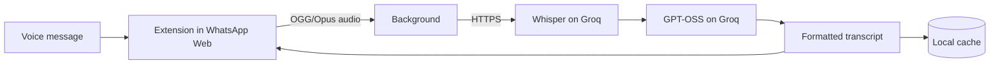

<div align="center">
  
  <h1>WhatsApp Audio Transcriber</h1>
  <p>Transcribe WhatsApp Web voice messages without leaving the conversation.</p>

  <p>
    <a href="https://chromewebstore.google.com/detail/transcri%C3%A7%C3%A3o-de-%C3%A1udios-do/dnfdcckllipjhijlddogocihdabnbblp"></a>
    <a href="https://github.com/gabrielMalonso/whatsapp-audio-transcriber/actions/workflows/ci.yml"></a>
    <a href="LICENSE"></a>
    <a href="https://developer.chrome.com/docs/extensions/develop/migrate/what-is-mv3"></a>
    <a href="https://groq.com/"></a>
  </p>

  <p>
    <a href="#installation">Installation</a> ·
    <a href="#how-it-works">How it works</a> ·
    <a href="PRIVACY.md">Privacy</a> ·
    <a href="#development">Development</a> ·
    <a href="CONTRIBUTING.md">Contributing</a>
  </p>
</div>

## About

WhatsApp Audio Transcriber is an open-source extension for Chrome, Firefox, and Zen Browser that adds transcripts directly to WhatsApp Web voice messages. Audio is processed through the Groq API with `whisper-large-v3-turbo`; then `openai/gpt-oss-20b` applies the formatting preferences selected in the popup.

Everything happens between the browser and Groq: the project runs no intermediary server, does not store audio, and keeps the API key and transcripts only in the extension's local storage.

> [!IMPORTANT]
> This is an independent project, not affiliated with WhatsApp, Meta, or Groq. Changes to WhatsApp Web may temporarily affect the extension.

## Features

- Transcription integrated into the WhatsApp Web interface;
- Automatic detection of the audio's language;
- Colloquial, natural, or formal tone;
- Optional formatting for paragraphs, dates, times, and lists;
- Formatting without answering, summarizing, or translating the content;
- Audio capture without audible playback of the voice message;
- Local queue with cancellation and progress indicators;
- Local cache to avoid reprocessing messages;
- Guided onboarding to create and configure a Groq API key;
- One codebase, with builds for Chrome and Firefox/Zen on macOS, Windows, and Linux;
- No Python, FFmpeg, local Whisper, or native host required.

## How it works


```mermaid
flowchart LR
    A[Voice message] --> B[Extension in WhatsApp Web]
    B -->|OGG/Opus audio| C[Background]
    C -->|HTTPS| D[Whisper on Groq]
    D --> E[GPT-OSS on Groq]
    E --> F[Formatted transcript]
    F --> G[(Local cache)]
    F --> B
```

1. The extension identifies voice messages using structural attributes in WhatsApp Web.
2. When you request a transcript, a script in the MAIN context captures the audio bytes and blocks playback.
3. The background sends the audio directly to Groq and processes one transcription at a time.
4. The raw transcript is formatted with strict rules and displayed in a component isolated by Shadow DOM.
5. The result is cached locally for subsequent visits to the conversation.

See [Architecture](docs/architecture.md) and [WhatsApp DOM research](docs/whatsapp-dom.md) for details.

## Installation

### Using a ready-made package

Install from the [Chrome Web Store](https://chromewebstore.google.com/detail/transcri%C3%A7%C3%A3o-de-%C3%A1udios-do/dnfdcckllipjhijlddogocihdabnbblp), open the extension popup, enter a [Groq API key](https://console.groq.com/keys), and click **Save and test** (shown as **Salvar e testar** in the current Portuguese interface).

To install a specific version manually:

1. Download and extract the package from the [Releases](https://github.com/gabrielMalonso/whatsapp-audio-transcriber/releases) page.
2. Open `chrome://extensions` in Google Chrome.
3. Enable **Developer mode**.
4. Click **Load unpacked** and select the folder containing `manifest.json`.

If no package has been published yet, create a local build by following the development section.

### Firefox and Zen Browser: temporary installation

Zen uses the same build as Firefox. Run `pnpm build:firefox` (or `pnpm build:zen`), then in your chosen browser:

1. Open `about:debugging#/runtime/this-firefox`.
2. Click **Load Temporary Add-on…**.
3. Select `apps/extension/.output/firefox-mv3/manifest.json`.
4. Open the popup, configure the API key, and click **Save and test** (shown as **Salvar e testar** in the current Portuguese interface).
5. Refresh WhatsApp Web. Check in `about:addons` that access to `web.whatsapp.com` and `api.groq.com` is allowed.

Temporary installation accepts the unsigned build and ends when the browser closes. Do not rely on it to preserve settings or cache between sessions. Reloading a temporary extension within the same session preserves local data.

### Firefox and Zen Browser: permanent installation and signing

`pnpm zip:firefox` (or `pnpm zip:zen`) generates `apps/extension/.output/watextension-0.2.3-firefox.zip`. This ZIP is **unsigned**; renaming it to `.xpi` does not make it permanently installable.

For distribution, submit the package to the [Mozilla developer portal](https://addons.mozilla.org/developers/) and choose publication on AMO or self-distribution (**unlisted / On your own**). Both undergo Mozilla signing and validation. WXT also generates `watextension-0.2.3-sources.zip` with the workspace, protocol, and lockfile for review. Because the code is compiled, provide this source code and instructions to reproduce the build when requested. Use Node 22+, pnpm 11, `pnpm install --frozen-lockfile`, and `pnpm zip:firefox`.

After obtaining the signed `.xpi`, open `about:addons`, use the gear menu → **Install Add-on From File…**, and select the XPI in either Firefox or Zen. There is no need to disable signature checks. This project does not yet have a signed Firefox package or AMO listing.

Firefox release/beta requires [Mozilla signing](https://extensionworkshop.com/documentation/publish/signing-and-distribution-overview/). Distribute the signed XPI for Zen as well. The manifest declares the fixed ID `whatsapp-audio-transcriber@gabrielalonso.dev`, a minimum Firefox version of 140, and [native data transmission consent](https://extensionworkshop.com/documentation/develop/firefox-builtin-data-consent/): an authentication key, personal communication, and voice recordings sent to Groq. The extension's notice before the first transcription remains in place.

### Updating

Extract the new version into the same folder, click **Reload** in `chrome://extensions`, and refresh WhatsApp Web. Do not remove the extension before updating if you want to preserve your local settings and cache.

For temporary Firefox/Zen installations, rebuild, click **Reload** on the extension card in `about:debugging`, and refresh WhatsApp Web. For permanent installations, increase the version with `pnpm version:extension X.Y.Z`, build and sign the new package with the **same ID**, and install the new XPI without uninstalling the previous one. AMO supports automatic updates; self-distribution updates automatically only if an `update_url` and update manifest are configured (not included in this project). Otherwise, install the new XPI manually.

## Privacy

| Data                         | Destination                    | Persistence                         |
| ---------------------------- | ------------------------------ | ----------------------------------- |
| API key                      | Groq, to authenticate requests | `browser.storage.local` via WXT     |
| Selected audio               | Groq, for transcription        | Not saved by the project            |
| Raw and formatted transcript | Only the extension             | Local cache, cleared from the popup |

The extension requests access only to local storage, WhatsApp Web, and the Groq API. API usage is subject to Groq's own terms, limits, and any applicable charges.

See the [Privacy Policy](PRIVACY.md) for all data processed, recipients, retention periods, and available controls.

Current limits:

- Up to 25 MB per audio file;
- Up to 10 queued jobs and one active transcription at a time;
- Up to 500 transcripts or approximately 8 MB in the local cache.

## Known limitations

- The extension requires a Groq account and API key;
- Automatic transcripts may contain errors, especially in important names and numbers;
- Only WhatsApp Web voice messages are supported;
- Changes to the WhatsApp interface may require an extension update;
- Manual installations are not automatically updated by Chrome.

## Development

### Requirements

- Node.js 22 or later;
- pnpm 11;
- Chrome or Firefox 140+ (Zen based on Firefox 140+);
- A Groq API key to test the actual workflow.

```bash
git clone https://github.com/gabrielMalonso/whatsapp-audio-transcriber.git
cd whatsapp-audio-transcriber
corepack enable
pnpm install
pnpm dev
```

The development environment is generated by WXT. `pnpm dev:firefox` and `pnpm dev:zen` use the `firefox` target in MV3; load `apps/extension/.output/firefox-mv3-dev/manifest.json` temporarily. Zen commands are aliases for Firefox: there is no third bundle. Without an installed browser runner, WXT generates the files and keeps the development server running; open the browser and load the extension manually, without adding dependencies.

For a production build:

```bash
pnpm build
```

Load this folder in Chrome:

```text
apps/extension/.output/chrome-mv3
```

### Commands

| Command                                 | Action                                             |
| --------------------------------------- | -------------------------------------------------- |
| `pnpm dev`                              | Starts the extension development environment       |
| `pnpm build`                            | Builds the protocol and extension                  |
| `pnpm test`                             | Runs tests with Vitest                             |
| `pnpm typecheck`                        | Checks TypeScript types                            |
| `pnpm lint`                             | Checks code with ESLint                            |
| `pnpm format:check`                     | Checks formatting with Prettier                    |
| `pnpm format`                           | Formats project files                              |
| `pnpm dev:chrome`                       | Alias for `pnpm dev` for Chrome                    |
| `pnpm dev:firefox` / `pnpm dev:zen`     | Firefox/Zen development, MV3                       |
| `pnpm build:chrome`                     | Chrome build in `.output/chrome-mv3`               |
| `pnpm build:firefox` / `pnpm build:zen` | Firefox/Zen build in `.output/firefox-mv3`         |
| `pnpm zip:chrome`                       | Chrome build and ZIP in `.output`                  |
| `pnpm zip:firefox` / `pnpm zip:zen`     | Unsigned Firefox/Zen build and ZIP                 |
| `pnpm check`                            | Runs all checks and both builds                    |
| `pnpm store:package`                    | Generates the Chrome Web Store ZIP and its SHA-256 |
| `pnpm version:extension X.Y.Z`          | Synchronizes the extension version                 |

### Browser validation

Automated tests and builds alone do not prove compatibility with the current WhatsApp version. In Chrome and Firefox/Zen, validate with your account and a Groq key:

On October 4, 2026, build 0.2.3 was temporarily installed in Zen 1.23b (Firefox 157, macOS). A sent 5-second audio message in the test conversation was captured, transcribed by Groq, and displayed; the playback control stayed at 0:00. The transcript was retrieved from the cache after refreshing WhatsApp, and popup preferences persisted. This test does not establish transcription quality or full compatibility. The scenarios below remain pending except for these specific checks, as does the actual workflow in Chrome and standalone Firefox.

- Open the popup, save/test the key, and check that preferences persist after closing and reopening it;
- Transcribe received and sent audio, already downloaded and not yet downloaded, **without sound**; confirm raw/formatted text, cache, and Groq calls;
- Play a message normally after capture; cancel capture and a queued job, retry after an error and after reconnecting the background;
- Refresh the page, switch conversations, reuse the cache, and check data preservation after an update;
- Deny site access and check recovery after granting permissions again.

### Structure

```text
apps/extension/       WXT + React extension
packages/protocol/    Shared Zod contracts
docs/                 Architecture and technical research
release/              Packages and manual distribution instructions
```

## Contributing

Contributions are welcome. Before submitting a pull request, read the [contribution guide](CONTRIBUTING.md) and [code of conduct](CODE_OF_CONDUCT.md). For vulnerabilities, follow the [security policy](SECURITY.md) instead of opening a public issue.

## License

Distributed under the [MIT License](LICENSE). Copyright © 2026 Gabriel Alonso.
