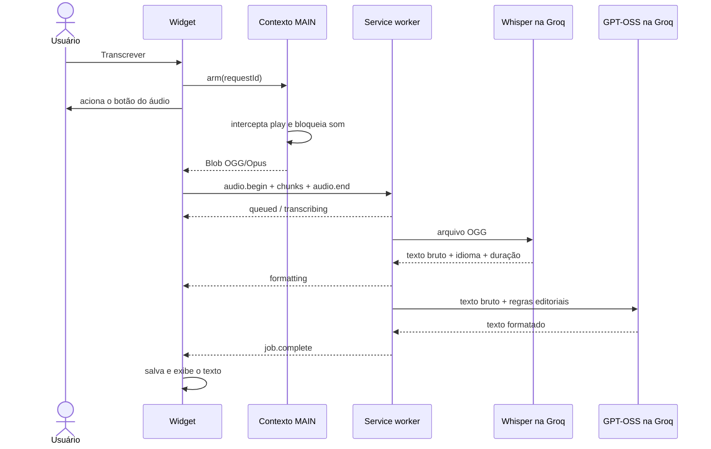

# Arquitetura

## Componentes

| Componente                 | Responsabilidade                                                                                            |
| -------------------------- | ----------------------------------------------------------------------------------------------------------- |
| `whatsapp-main.content.ts` | Intercepta `HTMLMediaElement.play` no contexto MAIN e aceita somente fontes `blob:` do próprio WhatsApp.    |
| `whatsapp.content`         | Exige ações reais do usuário e monta a UI React em Shadow DOM fechado.                                      |
| `pageBridge.ts`            | Arma a captura, permite cancelamento e valida tamanho, contêiner e assinatura do áudio recebido.            |
| `transcriptionClient.ts`   | Divide o áudio em blocos com backpressure, cancelamento imediato e um `runtime.Port` com o service worker.  |
| `background.ts`            | Remonta o áudio, valida ownership, expira montagens incompletas, mantém a fila serial e executa o provider. |
| `GroqProvider`             | Faz a transcrição com Whisper e passa o texto bruto para formatação estruturada pelo GPT-OSS.               |
| `packages/protocol`        | Define contratos Zod, modelos, estados, limites e erros compartilhados.                                     |

## Fluxo

## Formatação configurável

O `openai/gpt-oss-20b` é chamado a partir de 40 caracteres, com `reasoning_effort: low` e temperatura `0.3`. O prompt é montado dinamicamente a partir das preferências salvas no popup.

O usuário pode escolher:

- tom coloquial, natural ou formal;
- divisão em parágrafos;
- remoção determinística do último ponto de cada linha;
- formatação pt-BR de datas e horários;
- conversão de enumerações em listas.

As regras críticas proíbem resumo, tradução, resposta ao conteúdo e informações novas. A transcrição é delimitada por tags e tratada como dado, reduzindo risco de prompt injection.

## Estado e persistência

O widget trabalha com `idle`, `notice`, `capturing`, `queued`, `working`, `success` e `error`. O cache usa SHA-256 do `data-id` como chave e guarda tanto `text` quanto `rawText`.

A API key e as preferências de formatação permanecem no armazenamento local da extensão. O cache registra a versão das preferências para não reutilizar um texto formatado com ajustes diferentes.

## Multiplataforma

Não há executável auxiliar, Python ou Native Messaging. Captura, fila, rede e cache usam APIs do Chrome, portanto o mesmo pacote MV3 funciona em macOS, Windows e Linux.
