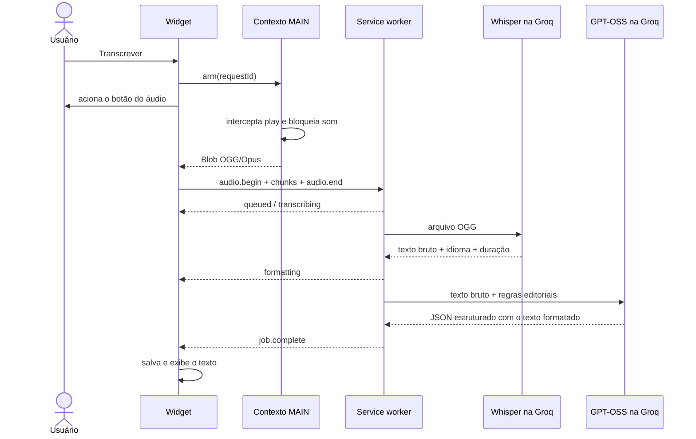

# Arquitetura

## Componentes

| Componente                 | Responsabilidade                                                                                                     |
| -------------------------- | -------------------------------------------------------------------------------------------------------------------- |
| `whatsapp-main.content.ts` | Intercepta `HTMLMediaElement.play` no contexto MAIN, lê o `Blob` e bloqueia a reprodução durante uma captura armada. |
| `whatsapp.content`         | Observa o DOM, encontra mensagens de voz e monta a UI React em Shadow DOM.                                           |
| `transcriptionClient.ts`   | Divide o áudio em blocos base64 e mantém um `runtime.Port` com o service worker.                                     |
| `background.ts`            | Remonta o áudio, mantém a fila serial, permite cancelamento e executa o provider.                                    |
| `GroqProvider`             | Faz a transcrição com Whisper e passa o texto bruto para formatação estruturada pelo GPT-OSS.                        |
| `packages/protocol`        | Define contratos Zod, modelos, estados, limites e erros compartilhados.                                              |

## Fluxo

## Formatação conservadora

O `openai/gpt-oss-20b` é chamado com `reasoning_effort: low` e Structured Outputs em modo estrito. O schema aceita somente `{ "text": string }`.

O prompt permite apenas:

- pontuação;
- capitalização;
- divisão em parágrafos.

Ele proíbe resumo, tradução, resposta ao conteúdo, títulos e informações novas. Instruções eventualmente faladas no áudio são delimitadas e tratadas como dados, reduzindo risco de prompt injection.

## Estado e persistência

O widget trabalha com `idle`, `notice`, `capturing`, `queued`, `working`, `success` e `error`. O cache usa SHA-256 do `data-id` como chave e guarda tanto `text` quanto `rawText`.

A API key é manipulada somente pelo popup e pelo service worker. Ela permanece no armazenamento local da extensão; não é incorporada ao bundle nem enviada ao contexto da página.

## Multiplataforma

Não há executável auxiliar, Python ou Native Messaging. Captura, fila, rede e cache usam APIs do Chrome, portanto o mesmo pacote MV3 funciona em macOS, Windows e Linux.
