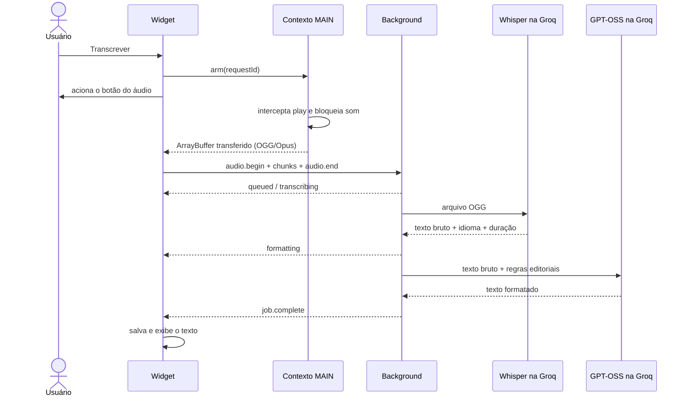

# Arquitetura

## Componentes

| Componente                 | Responsabilidade                                                                                            |
| -------------------------- | ----------------------------------------------------------------------------------------------------------- |
| `whatsapp-main.content.ts` | Intercepta `HTMLMediaElement.play` no contexto MAIN e aceita somente fontes `blob:` do próprio WhatsApp.    |
| `whatsapp.content`         | Exige ações reais do usuário e monta a UI React em Shadow DOM fechado.                                      |
| `pageBridge.ts`            | Arma a captura, permite cancelamento e valida tamanho, contêiner e assinatura do áudio recebido.            |
| `transcriptionClient.ts`   | Divide o áudio em blocos com backpressure, cancelamento imediato e um `runtime.Port` com o background.      |
| `background.ts`            | Remonta o áudio, valida ownership, expira montagens incompletas, mantém a fila serial e executa o provider. |
| `GroqProvider`             | Faz a transcrição com Whisper e passa o texto bruto para formatação estruturada pelo GPT-OSS.               |
| `packages/protocol`        | Define contratos Zod, modelos, estados, limites e erros compartilhados.                                     |

## Fluxo

```mermaid
sequenceDiagram
    actor U as Usuário
    participant UI as Widget
    participant P as Contexto MAIN
    participant B as Background
    participant W as Whisper na Groq
    participant G as GPT-OSS na Groq

    U->>UI: Transcrever
    UI->>P: arm(requestId)
    UI->>U: aciona o botão do áudio
    P->>P: intercepta play e bloqueia som
    P-->>UI: ArrayBuffer transferido (OGG/Opus)
    UI->>B: audio.begin + chunks + audio.end
    B-->>UI: queued / transcribing
    B->>W: arquivo OGG
    W-->>B: texto bruto + idioma + duração
    B-->>UI: formatting
    B->>G: texto bruto + regras editoriais
    G-->>B: texto formatado
    B-->>UI: job.complete
    UI->>UI: salva e exibe o texto
```

## Formatação configurável

O `openai/gpt-oss-20b` é chamado a partir de 40 caracteres, com `reasoning_effort: low` e temperatura `0.3`. O prompt é montado dinamicamente a partir das preferências salvas no popup.

O usuário pode escolher:

- tom coloquial, natural ou formal;
- divisão em parágrafos;
- remoção determinística do último ponto de cada linha;
- formatação pt-BR de datas e horários;
- conversão de enumerações em listas.

As regras críticas proíbem resumo, tradução, resposta ao conteúdo e informações novas. A transcrição é delimitada por tags e tratada como dado, reduzindo risco de prompt injection.

## Estado e persistência

O widget trabalha com `idle`, `notice`, `capturing`, `queued`, `working`, `success` e `error`. O cache usa SHA-256 do `data-id` como chave e guarda tanto `text` quanto `rawText`.

A API key e as preferências de formatação permanecem no armazenamento local da extensão. O cache registra a versão das preferências para não reutilizar um texto formatado com ajustes diferentes.

## Multiplataforma

Não há executável auxiliar, Python ou Native Messaging. Captura, fila, rede e cache usam `wxt/browser`, que seleciona as APIs nativas do navegador. Uma base de código gera dois pacotes MV3: `chrome-mv3` e `firefox-mv3` (também usado no Zen). O WXT gera `background.service_worker` no Chrome e `background.scripts` no Firefox, sem manifesto ou background duplicados.

O script MAIN é declarativo, carregado em `document_start`; Firefox suporta esse contexto desde 128, e o projeto exige 140 para o consentimento nativo de dados da Mozilla. Não há injeção por tag `<script>`, permissões de scripting extras ou dependência da CSP da página para carregar um script externo.

A ponte usa `window.postMessage` com origem exata e requestId, aceitando `source: null` em contextos de extensão do Firefox. MAIN lê o Blob local, transfere um ArrayBuffer e o content script cria seu próprio Blob, evitando objetos Blob da página através da fronteira Xray do Firefox. A validação do buffer independe do protótipo do contexto de origem. Os blocos usam views explícitas de Uint8Array: `subarray` tenta acessar `constructor` através do wrapper Xray e pode ser bloqueado no Firefox. O content script valida contêiner e tamanho e envia blocos Base64 pelo `runtime.Port`, compatíveis também com a serialização JSON do Chrome. A captura só aciona o botão após receber a confirmação de que MAIN está armado; o `play` original não é chamado durante a captura.

Popup, cache, fila e Groq são os mesmos nos dois builds. As requisições HTTPS à Groq ocorrem no background, sob `host_permissions`, nunca no contexto MAIN ou no content script. O ID Gecko permanece fixo para preservar os dados nas atualizações; Chrome não recebe campos Gecko. O fallback de `action.openPopup()` abre a mesma página do popup numa aba quando a API não está disponível ou exige gesto do usuário.
