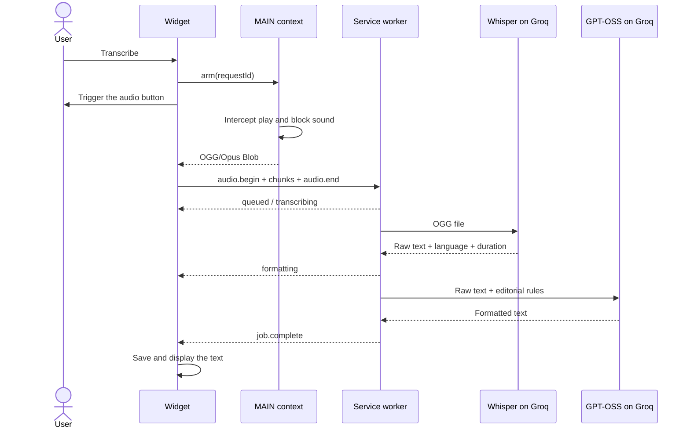

# Architecture

## Components

| Component                  | Responsibility                                                                                                            |
| -------------------------- | ------------------------------------------------------------------------------------------------------------------------- |
| `whatsapp-main.content.ts` | Intercepts `HTMLMediaElement.play` in the MAIN context and accepts only WhatsApp's own `blob:` sources.                   |
| `whatsapp.content`         | Requires genuine user actions and mounts the React UI in a closed Shadow DOM.                                             |
| `pageBridge.ts`            | Arms capture, supports cancellation, and validates the received audio's size, container, and signature.                   |
| `transcriptionClient.ts`   | Splits audio into chunks with backpressure, immediate cancellation, and a `runtime.Port` to the service worker.           |
| `background.ts`            | Reassembles audio, validates ownership, expires incomplete assemblies, maintains the serial queue, and runs the provider. |
| `GroqProvider`             | Transcribes with Whisper and sends raw text to GPT-OSS for structured formatting.                                         |
| `packages/protocol`        | Defines shared Zod contracts, models, states, limits, and errors.                                                         |

## Flow

```mermaid
sequenceDiagram
    actor U as User
    participant UI as Widget
    participant P as MAIN context
    participant B as Service worker
    participant W as Whisper on Groq
    participant G as GPT-OSS on Groq

    U->>UI: Transcribe
    UI->>P: arm(requestId)
    UI->>U: Trigger the audio button
    P->>P: Intercept play and block sound
    P-->>UI: OGG/Opus Blob
    UI->>B: audio.begin + chunks + audio.end
    B-->>UI: queued / transcribing
    B->>W: OGG file
    W-->>B: Raw text + language + duration
    B-->>UI: formatting
    B->>G: Raw text + editorial rules
    G-->>B: Formatted text
    B-->>UI: job.complete
    UI->>UI: Save and display the text
```

## Configurable formatting

`openai/gpt-oss-20b` is called for transcripts of at least 40 characters, with `reasoning_effort: low` and a temperature of `0.3`. The prompt is built dynamically from the preferences saved in the popup.

Users can choose:

- A colloquial, natural, or formal tone;
- Paragraph breaks;
- Deterministic removal of the final period on each line;
- Brazilian Portuguese date and time formatting;
- Conversion of enumerations into lists.

The critical rules prohibit summarizing, translating, answering the content, and adding new information. The transcript is delimited by tags and treated as data, reducing the risk of prompt injection.

## State and persistence

The widget uses `idle`, `notice`, `capturing`, `queued`, `working`, `success`, and `error`. The cache uses the SHA-256 hash of `data-id` as its key and stores both `text` and `rawText`.

The API key and formatting preferences remain in the extension's local storage. The cache records the preferences version to avoid reusing text formatted with different settings.

## Cross-platform support

There is no helper executable, Python, or Native Messaging. Capture, queuing, networking, and caching use Chrome APIs, so the same MV3 package works on macOS, Windows, and Linux.
